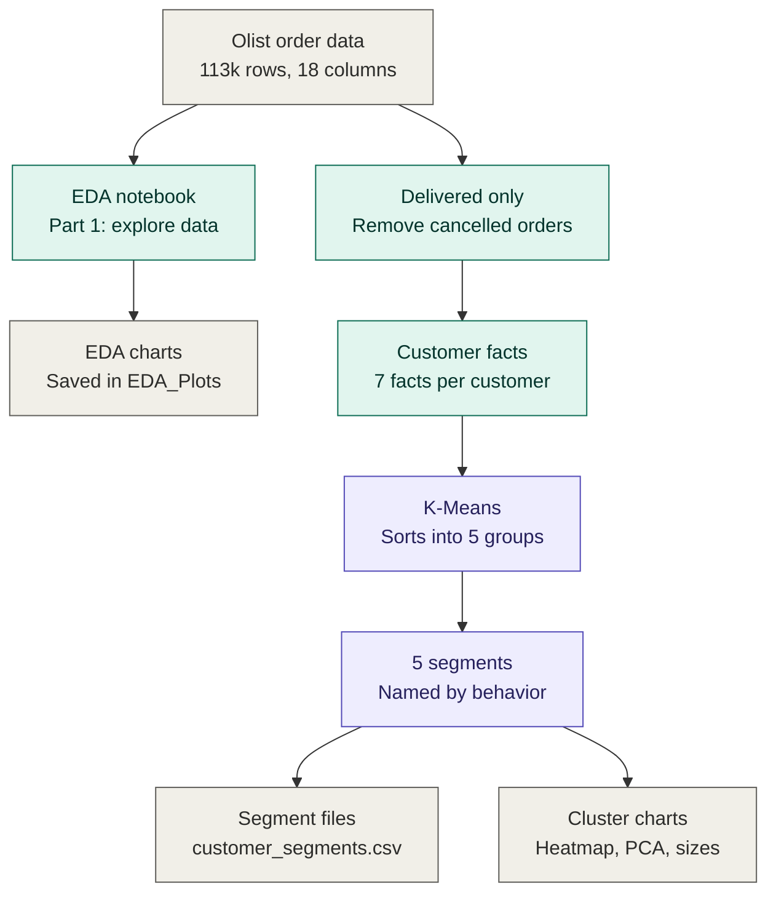

# Olist Customer Segmentation

**Finding out who an online store's customers really are, and sorting them into 5 easy-to-understand groups.**

---

## Overview

Olist is a Brazilian online marketplace. This project takes real order data from Olist (around 113,000 order rows and 93,000 customers) and answers a simple question:

> *"Are all our customers the same, or are there different types of customers who behave differently?"*

The project has two parts:

1. **Data Exploration (EDA)**: Looking carefully at the raw data, cleaning it, and understanding what is in it.
2. **Customer Segmentation (K-Means Clustering)**: Letting the computer automatically sort customers into groups of similar behavior.

You do **not** need to know programming or AI to understand the results. Every result below is explained in plain words.

---

## Aim

To help a business:

- Understand what its data looks like and whether it can be trusted
- Discover the different *types* of customers it has
- See which customers spend more, which are unhappy with delivery, and which come back to buy again
- Make smarter decisions about marketing, delivery and shipping prices

---

## Problem Statement

Most online stores treat every customer the same. But a customer who spends 35 and a customer who spends 260 are very different. So are a customer whose parcel arrived late and one who got it early.

Without knowing these differences, a business ends up sending the same offer to everyone, missing unhappy customers, and wasting money. This project solves that by **grouping customers by how they actually behave**.

---

## Key Findings (in simple words)

| # | What we found |
|---|---------------|
| 1 | Only **3 out of every 100 customers** ever came back for a second purchase. Most people buy once and never return. |
| 2 | **São Paulo (SP)** is the biggest market by far, with about 41,700 orders. The next state, Rio de Janeiro, has about 12,900. |
| 3 | Most prices are small, but a few items are very expensive (up to 6,735). These rare, extreme values can confuse analysis, so they were handled carefully. |
| 4 | Parcels usually arrive **about 11 days earlier than promised**. But one group of customers gets parcels late. |
| 5 | Items that cost more also tend to cost more to ship (a clear link between price and shipping cost). |
| 6 | Customers fall into **5 clear types** (see below). |

---

## System Architecture



**Colour guide:** grey = data and results, green = data preparation, purple = machine learning.

---

## The 5 Customer Groups

The computer found these groups on its own. We then gave each one a simple name based on how its members behave.

| Group | Share of customers | What they are like |
|-------|-------------------|--------------------|
| **Fast-delivery, mid-value buyers** | 43.5% | The largest group. Average spend of about 183, parcels arrive quickly (about 9 days), low shipping cost share. Happy, steady customers. |
| **Low-value, freight-heavy** | 27.2% | Spend very little (about 35 on average), and shipping makes up about 35% of what they pay. Shipping cost is a big part of their bill. |
| **Late-delivery customers** | 17.4% | Wait about 25 days for their parcel, and on average it arrives *after* the promised date. Most at risk of being unhappy. |
| **Multi-item basket buyers** | 8.9% | Buy about 2 to 3 items in one order. Average spend of about 210. |
| **Repeat customers** | 3.0% | The only group that came back to buy again. They also spend the most per customer (about 260). Small group, but very valuable. |

### What a business could do with this

*(These are practical ideas based on the groups, not results produced by the code.)*

- **Repeat customers**: reward and protect them. They are rare and valuable.
- **Late-delivery customers**: fix delivery problems and follow up with an apology or a discount.
- **Low-value, freight-heavy**: try free-shipping thresholds or bundled offers.
- **Multi-item basket buyers**: suggest "buy together" deals.
- **Fast-delivery, mid-value buyers**: encourage a second purchase, since only 3% currently return.

---

## How It Works

Think of it like sorting a big pile of mixed laundry into whites, darks and colors. Nobody tells the computer what the piles are. It looks at the clothes and groups the ones that look alike.


### Part 1: Data Exploration (`Olist_Complete_EDA.ipynb`)

This notebook is a full health check of the data:

- How many rows and columns? What is missing? Are there duplicates?
- Which states and cities order the most?
- How are prices and shipping costs spread out?
- Are there extreme values (outliers), and how should they be handled?
- Do price and shipping cost move together?
- Charts: histograms, box plots, scatter plots, pair plot, correlation heatmap

All charts are saved as images in a folder called `EDA_Plots`.

### Part 2: Customer Segmentation (`Olist_KMeans_Clustering_v2_fixed.ipynb`)

This notebook turns the orders into **one row per customer** and describes each customer with 7 simple facts:

| Fact about the customer | Plain meaning |
|-------------------------|---------------|
| Recency (days) | How long ago they last bought |
| Is repeat | Did they ever buy more than once? |
| Total spending | How much money they spent in total |
| Items per order | How many items they usually buy at once |
| Freight share | What part of their payment went to shipping |
| Delivery days | How long their parcels took |
| Delivery delay | Were parcels early or late compared to the promise? |

Only **delivered** orders were used, because cancelled orders are not real purchases and delivery time cannot be measured without a delivery date.

Then K-Means sorted the **93,350 customers** into 5 groups.

---

## Why 5 Groups?

K-Means needs us to choose how many groups to make. We tried 2 to 8 and compared them using four scores. Groups of 4 and 5 scored almost the same on the main score. We picked **5** because it scored better on two other checks and because it separates out a useful **"late-delivery"** group that 4 groups would have mixed into others.

**Is the result reliable?** We re-ran the grouping with 4 different random starting points. The groups came out almost exactly the same each time (agreement score between 0.98 and 0.999, where 1.0 means identical). So the result is stable and not a lucky accident.

---

## Project Files

```
.
├── Olist_Complete_EDA.ipynb                  # Part 1: explore and clean the data
├── Olist_KMeans_Clustering_v2_fixed.ipynb    # Part 2: group the customers
├── olist_merged_dataset.csv                  # Input data (you must add this file)
├── customer_segments.csv                     # Output: every customer and their group
├── cluster_profile.csv                       # Output: summary of each group
└── EDA_Plots/                                # Output: all charts as images
```

---

## How to Run It

**1. Install Python libraries**

```bash
pip install pandas numpy matplotlib seaborn scipy scikit-learn jupyter
```

**2. Add the data**

Place `olist_merged_dataset.csv` in the same folder as the notebooks.

**3. Open and run**

```bash
jupyter notebook
```

Open the notebooks and run them from top to bottom. Run the EDA first, then the clustering notebook.

---

## Tools Used

| Tool | What it is used for |
|------|---------------------|
| Python | The programming language |
| pandas, NumPy | Handling and calculating with data tables |
| Matplotlib, Seaborn | Drawing charts |
| SciPy | Statistical tests |
| scikit-learn | The K-Means grouping, scaling and visualization |

---

## Benefits

- **Know your customers**: see real types of customers instead of one big average
- **Spot problems early**: find the group suffering from late deliveries
- **Smarter marketing**: send the right offer to the right group
- **Protect valuable customers**: identify the small group that returns and spends more
- **Easy to read**: every group has a clear name and a short description

---

## Limitations (Honest Notes)

- **Group separation is moderate.** The groups overlap somewhat (silhouette score 0.22). They are useful for understanding, but customers near the edges could fit in more than one group.
- **Very few repeat customers (3%).** This makes it harder to learn deeply about loyal behavior.
- **Group names are our own labels.** The computer finds the groups. People decide what to call them.
- **Based on past orders only.** The groups describe what customers did, not what they will do next.
- **Missing values in the EDA were filled with simple rules** (median for numbers, most common value for text). That is fine for exploration, but a real business project might treat dates and IDs more carefully.

---

## Simple Glossary

| Word | Meaning |
|------|---------|
| **EDA** | Exploratory Data Analysis: looking at data carefully before using it |
| **Clustering** | Automatically sorting things into groups of similar items |
| **K-Means** | One popular method of clustering. "K" is the number of groups |
| **Outlier** | A value far from the rest, such as one very expensive item |
| **Freight** | Shipping cost |
| **Recency** | How recently a customer bought something |
| **Segment** | A named group of similar customers |

---

## Conclusion

This project shows that "the customer" is not one person but five different kinds of people. By cleaning the data, describing each customer with a few simple facts, and letting K-Means sort them, we found a large steady group, a price-sensitive group, a group hurt by late delivery, a group that buys many items at once, and a small but very valuable group of repeat buyers.

Knowing this, a business can stop treating everyone the same and focus its effort where it matters most.
